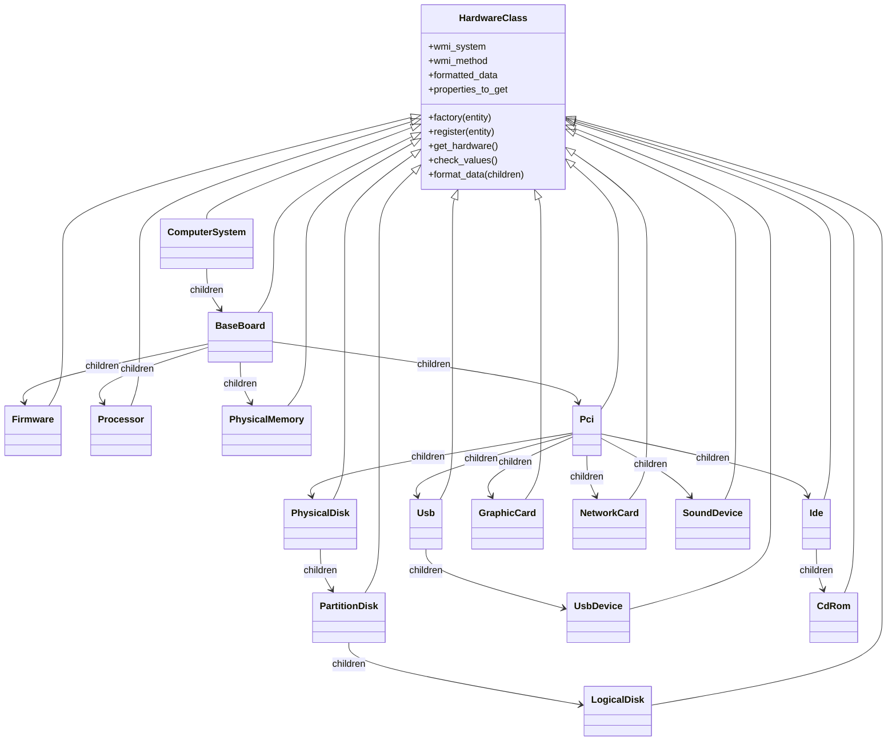

# Architecture Documentation

This document provides a high-level overview of the `lshw-windows-emulator` architecture.

## Class Diagram

The core of the application is the `HardwareClass`, an abstract base class that implements the Factory pattern. Specific hardware components inherit from this class and implement their own data retrieval and formatting logic.

## Key Components

| Component           | Purpose                                                                                                                                                                           |
| :------------------ | :-------------------------------------------------------------------------------------------------------------------------------------------------------------------------------- |
| **HardwareClass**   | Abstract Base Class (ABC) that handles the WMI connection (via `WMIConnection` singleton) and provides utility methods for WQL queries (`build_wql_select`, `execute_wql_query`). |
| **Factory Pattern** | The `HardwareClass` uses a registration decorator/factory method to instantiate the correct class based on the hardware entity string (e.g., 'processor', 'network').             |
| **WMI Connection**  | Managed by a Singleton class `WMIConnection` to ensure efficient resource usage throughout the application lifecycle.                                                             |

## Data Flow

1. **CLI Entry Point** (`__main__.py`): Parses arguments and requests a specific hardware class (or 'ComputerSystem' for full output).
2. **Factory**: Instantiates the requested class (e.g., `NetworkCard`).
3. **Data Retrieval**: The instance connects to WMI, executes the relevant WQL query, and standardizes handling of missing properties.
4. **Formatting**: The `format_data()` method processes the raw WMI results into a standard Python dictionary or list of dictionaries.
5. **Output**: The result is printed to stdout as JSON or pretty-printed text.
