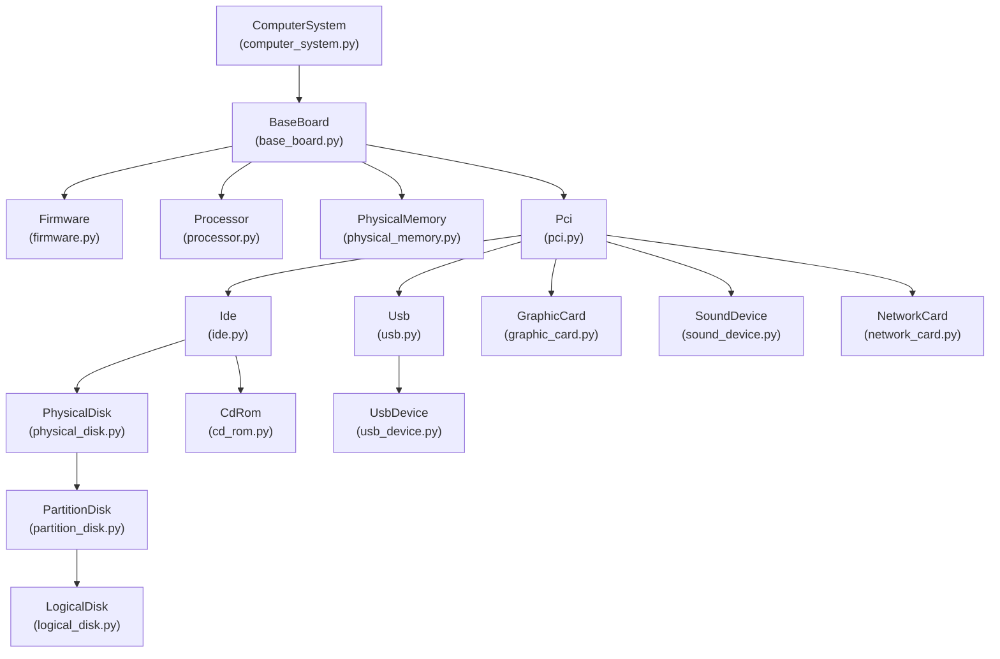

# Architecture — LsHw Windows Emulator

This document explains the design decisions, structural patterns, and security model behind `lshw-windows-emulator`.

## High-Level Overview

The application follows three complementary design patterns layered on a WMI data source:

1. **Factory + Registry** — Dispatches CLI requests to the correct hardware class without hardcoding class names.
2. **Template Method** — Defines the algorithm skeleton (fetch → populate → serialize) while letting subclasses fill in WMI-specific details.
3. **Security Allowlist** — Prevents unauthorized WMI entity access via a centralized, immutable allowlist with case-insensitive validation.

## Core Components

| Component | Pattern | Role |
| :--- | :--- | :--- |
| **`HardwareClass`** | Abstract Base Class | WMI connection management, WQL query building, allowlist validation, and the `format_data()` template method skeleton. |
| **`Hardware`** | `@dataclass` | Pure data container with 30 fields (`id`, `class_`, `vendor`, `serial`, children, optional properties) and `to_dict()` serialization. |
| **`WMIConnection`** | Singleton | Lazily initializes a single `wmi.WMI()` instance — prevents connection thrashing during recursive hardware tree traversal. |
| **`_WMI_ENTITY_ALLOWLIST`** | `frozenset` (immutable) | Centralized list of 22 authorized WMI entity names, normalized to lowercase. Backed by `_validate_entity()` for case-insensitive enforcement and `_sanitize_wql_value()` for WQL injection defense. |

## Design Patterns in Detail

### Factory + Registry

Each hardware subclass self-registers via the `@HardwareClass.register('Name', parent='ParentName')` decorator at import time. The CLI dispatches via `HardwareClass.factory(name)()` — no `if/elif` chain needed.

```python
@classmethod
def factory(cls, entity):
    return cls._entities_[entity]

@classmethod
def register(cls, entity, parent=None):
    def decorator(subclass):
        cls._entities_[entity] = subclass
        subclass._entity_ = entity
        if parent:
            # builds parent → children graph for recursive traversal
        return subclass
    return decorator
```

Module auto-discovery in `lshw/classes/__init__.py` uses `pkgutil.iter_modules()` to import all `.py` files in the package. This means **adding a new hardware class requires only creating the file** — no manual import registration needed.

> **ADR**: See [001-factory-registry-pattern.md](../adr/001-factory-registry-pattern.md) for the full decision record.

### Template Method

`format_data(children=False)` defines the algorithm skeleton:

```txt
get_hardware() → populate_hardware() → optionally fetch_children()
```

Subclasses implement `_populate_hardware(item_ret, hw_item)` as the hook to map WMI attributes to `Hardware` fields. The base class handles WQL execution, error handling, and recursive child traversal.

### Security Allowlist

The `_WMI_ENTITY_ALLOWLIST` is a `frozenset` of 22 lowercase WMI entity names — immutable at runtime, preventing privilege escalation via list injection. Every WMI access path is gated by `_validate_entity(entity)`, which performs case-insensitive lookup and raises `ValueError` with a logged `Security Alert` for unauthorized attempts.

WQL injection is prevented by `_sanitize_wql_value(value)`, which strips double quotes, single quotes, and semicolons from any user-controlled string interpolated into WHERE clauses.

> **ADR**: See [002-wmi-entity-allowlist.md](../adr/002-wmi-entity-allowlist.md) for the security rationale.

### Device ID Normalization

WMI association classes (e.g., `Win32_IDEControllerdevice`) link components via `Antecedent`/`Dependent` properties containing device ID strings with inconsistent backslash escaping and case. The project applies a canonical normalization pipeline:

1. Parse association strings: `.split('=')[1].replace('"', '').replace('\\\\', '\\')`
2. Normalize device IDs: `.strip().replace('\\', '').lower()`

This is applied uniformly in `ide.py`, `partition_disk.py`, `logical_disk.py`, `usb_device.py`, and `pci.py`.

> **ADR**: See [003-name-matching-strategy.md](../adr/003-name-matching-strategy.md) for the full normalization strategy.

## Hardware Tree Hierarchy



## Data Fetching Lifecycle

When a query is made (e.g., `lshw --json`):

1. **CLI Entry Point** (`__main__.py`): Parses arguments, resolves `--class-hw` or defaults to `ComputerSystem` with `children=True`.
2. **Factory Resolution**: `HardwareClass.factory('ComputerSystem')()` instantiates the registered class.
3. **WMI Connection**: Instance obtains the `WMIConnection` singleton.
4. **Retrieval**: `get_hardware()` executes WQL queries or WMI method calls, all gated by `_validate_entity()`.
5. **Standardization**: `format_data()` calls `_populate_hardware()` to map raw WMI attributes to the `Hardware` dataclass.
6. **Child Discovery**: If `children=True`, recursively calls `format_data(children=True)` on registered children via `_fetch_children()`.
7. **Serialization**: The tree is rendered as indented text (`pretty()`) or JSON (`json.dumps()`).

## Design Constraints

- **Python 3.6+**: Code uses `dataclasses` backport for Python < 3.7. No structural pattern matching.
- **WMI Reliability**: All WMI access paths are wrapped in try/except blocks with `logger.debug()` for operational visibility. Fallback strategies exist for association-based queries that fail on certain Windows versions.
- **Cross-Platform Safety**: The `wmi` module is conditionally imported via `sys.platform == 'win32'`. On non-Windows systems, a stub module is injected at `sys.modules['wmi']` for testability.
- **Zero Native Dependencies**: Relies exclusively on `wmi` (Python wrapper) and `psutil` — no C compilation required.

## Related Documents

- [ADR 001: Factory + Registry Pattern](../adr/001-factory-registry-pattern.md)
- [ADR 002: WMI Entity Allowlist](../adr/002-wmi-entity-allowlist.md)
- [ADR 003: Device ID Normalization Strategy](../adr/003-name-matching-strategy.md)
- [Codebase Audit Report](../governance/audits/codebase_audit_report.md)
- [How to Add Hardware Classes](../how-to/adding-hardware-classes.md)
- [WMI Mapping Reference](../reference/wmi-mapping.md)
