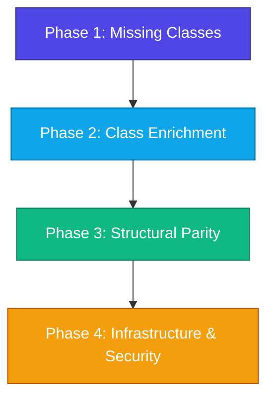

# Linux Parity Specification & Roadmap

This document outlines the technical specification, database/WMI mappings, and architectural enhancements required to bring the **LsHw Windows Emulator** to 100% feature parity with the native Linux `lshw` tool.

---

## Objective

Ensure that the output structure, device hierarchy, class names, and real-time network/storage data generated on Windows match the original Linux tool exactly. This guarantees seamless, drop-in integration with cross-platform agents like `migasfree-client` without requiring downstream parsers to handle OS-specific schema variations.

---

## Roadmap Overview



---

## Phase 1: Implementation of Missing Hardware Classes

Three completely new hardware classes must be written as standalone modules in `lshw/classes/` and registered with the factory.

### 1.1 `power` (Power Supplies and Batteries)

*   **CLI Identifier:** `power`
*   **Target Factory Class:** `Power`
*   **Parent Node:** `BaseBoard` (class key: `core`)
*   **WMI Source Classes:** `Win32_Battery`, `Win32_PortableBattery`, `Win32_UninterruptiblePowerSupply`
*   **Required Fields Mapping:**

| Target `Hardware` Field | WMI Source Property | Mapping / Parsing Rules |
|-------------------------|---------------------|-------------------------|
| `id` | `DeviceID` | `"power:N"` (where N is a zero-indexed sequence) |
| `class_` | *(Fixed)* | `"power"` |
| `description` | `Description` | General device description |
| `product` | `Name` or `Caption` | e.g. `"Primary Battery"`, `"Dell APC UPS"` |
| `vendor` | `Manufacturer` | Battery OEM vendor |
| `serial` | `SerialNumber` | If exposed; fallback to empty |
| `capacity` | `DesignCapacity` | Full capacity in **mWh** |
| `configuration.chemistry`| `Chemistry` | e.g. `"Lithium Ion"`, `"Lead Acid"` |

---

### 1.2 `printer` (Printers & Print Queues)

*   **CLI Identifier:** `printer`
*   **Target Factory Class:** `Printer`
*   **Parent Node:** `BaseBoard` (class key: `core`)
*   **WMI Source Class:** `Win32_Printer`
*   **Required Fields Mapping:**

| Target `Hardware` Field | WMI Source Property | Mapping / Parsing Rules |
|-------------------------|---------------------|-------------------------|
| `id` | `Name` | `"printer:N"` (sequence) |
| `class_` | *(Fixed)* | `"printer"` |
| `description` | `Caption` | Device description |
| `product` | `DriverName` | Print processor / driver identifier |
| `vendor` | *(Computed)* | Extracted from `DriverName` or `Manufacturer` if available |
| `logicalname` | `PortName` | e.g. `"LPT1:"`, `"USB001"`, `"192.168.1.50"` |
| `configuration.network` | `Network` | Boolean: `"true"` if shared network queue |
| `configuration.local` | `Local` | Boolean: `"true"` if physical local printer |

---

### 1.3 `communication` (Serial Ports & Modems)

*   **CLI Identifier:** `communication`
*   **Target Factory Class:** `Communication`
*   **Parent Node:** `Pci` (under host bridge)
*   **WMI Source Classes:** `Win32_SerialPort`, `Win32_POTSModem`
*   **Required Fields Mapping:**

| Target `Hardware` Field | WMI Source Property | Mapping / Parsing Rules |
|-------------------------|---------------------|-------------------------|
| `id` | `DeviceID` | `"communication:N"` (sequence) |
| `class_` | *(Fixed)* | `"communication"` |
| `description` | `Description` | e.g. `"Communications Port"` |
| `product` | `Name` | Port descriptor |
| `vendor` | `ProviderType` | e.g. `"Standard Port"` |
| `logicalname` | `DeviceID` | e.g. `"COM1"`, `"COM2"` |
| `clock` | `MaxBaudRate` | Maximum speed in baud |

---

## Phase 2: Enrichment of Existing Classes

Enhance data extraction logic in classes that are currently mapped but return incomplete configurations.

### 2.1 Complete Network Status (`network`)

The current implementation leaves critical runtime details (IP address, driver, link state) blank.
*   **Enhancement:** Jointly query `Win32_NetworkAdapter` and `Win32_NetworkAdapterConfiguration` using a join-match on `InterfaceIndex` or `Index`.
*   **Field Additions:**

```python
# To be added to network_card.py:
item_ret.logicalname = hw_item.get('NetConnectionID') # Connection name (e.g. "Ethernet")
item_ret.configuration['driver'] = hw_item.get('ServiceName') # Active driver service
item_ret.configuration['driverversion'] = self._get_driver_version(hw_item.get('PNPDeviceID'))
item_ret.configuration['ip'] = config_item.get('IPAddress')[0] if config_item.get('IPAddress') else ""
item_ret.configuration['link'] = "yes" if hw_item.get('NetConnectionStatus') == 2 else "no"
```

---

### 2.2 RAM Part Numbers & String Enums (`memory`)

Replace raw numeric SMBIOS types with standardized string labels and extract physical part/serial codes.
*   **Enhancement 1: Memory Type Mapping:**
    Create a mapping dictionary matching standard JEDEC/SMBIOS specifications:
    `24` → `"DDR3"`, `26` → `"DDR4"`, `34` → `"DDR5"`. Set this text as `product`.
*   **Enhancement 2: Serialization:**
    Retrieve `SerialNumber` and `PartNumber` from `Win32_PhysicalMemory`:
    `item_ret.serial = hw_item.get('SerialNumber').strip()`
    `item_ret.product = f"{memory_type_str} (Part: {hw_item.get('PartNumber').strip()})"`

---

### 2.3 Storage Controller Classification Refactoring (`ide` → `storage`)

Rename and realign storage controllers to match Linux naming conventions.
*   **Enhancement:**
    *   Change the CLI class argument from `--class-hw ide` to `--class-hw storage` (while maintaining `ide` as an alias for backwards compatibility).
    *   Ensure the `class_` attribute of the serialized controller node is set to `"storage"` (instead of being empty `""`).

---

### 2.4 Physical Disk Serials (`disk`)

*   **Enhancement:** Retrieve `SerialNumber` from `Win32_DiskDrive` and populate `serial`. Strip any leading/trailing whitespace which WMI often pads into this field.

---

## Phase 3: Structural and Hierarchical Alignments

Implement parent-child nesting rules to closely mirror physical layouts.

### 3.1 Cache Memory Nodes

*   **Enhancement:**
    *   Create `CacheMemory` class.
    *   Query `Win32_CacheMemory` to obtain L1, L2, L3 details.
    *   Map them as child nodes of the respective `Processor` socket node instead of flat children of the motherboard.

### 3.2 PCI Topology Matching

*   **Enhancement:**
    *   Instead of dumping all onboard devices (Display, NIC, Sound) under the first PCI bridge (`pci:0`), parse the WMI `DeviceID` or registry keys to determine the correct target bridge slot index.
    *   If no matching bridge slot index is resolved, fall back to `pci:0` gracefully.

---

## Phase 4: Infrastructure & Security System Updates

To support the above enhancements, the core emulator system must be updated to maintain runtime stability and prevent security vulnerabilities.

### 4.1 WMI Security Allowlist Extensions

The global `_WMI_ENTITY_ALLOWLIST` in `lshw/classes/hardware_class.py` must be expanded to permit the new WMI classes.

**Additions to the Allowlist (normalized to lowercase):**
*   `win32_battery`
*   `win32_portablebattery`
*   `win32_uninterruptiblepowersupply`
*   `win32_printer`
*   `win32_serialport`
*   `win32_potsmodem`
*   `win32_networkadapterconfiguration`
*   `win32_cachememory`

---

### 4.2 CLI Registration Updates

Update `lshw/__main__.py` to declare the new user-facing classes:

```python
# To be added to AVAILABLE_CLASSES in __main__.py:
AVAILABLE_CLASSES = {
    # Existing classes ...
    'power': 'Power',
    'printer': 'Printer',
    'communication': 'Communication',
}

# Update _exit_manager to handle new exit codes:
# - Code 17: Error getting power information
# - Code 18: Error getting printer information
# - Code 19: Error getting communication information
```
