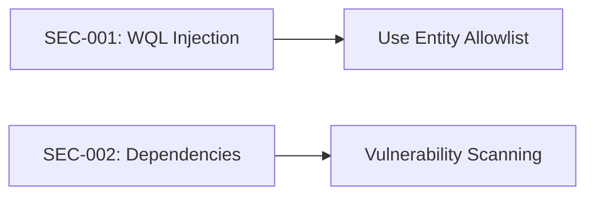
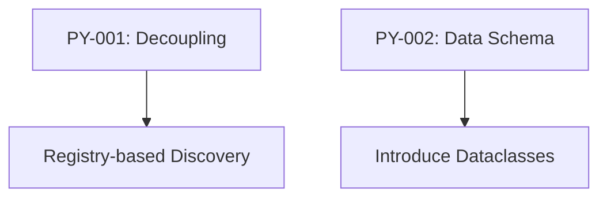
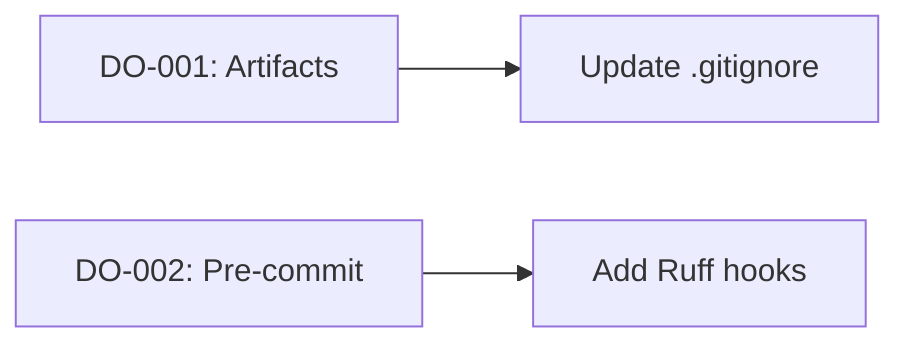
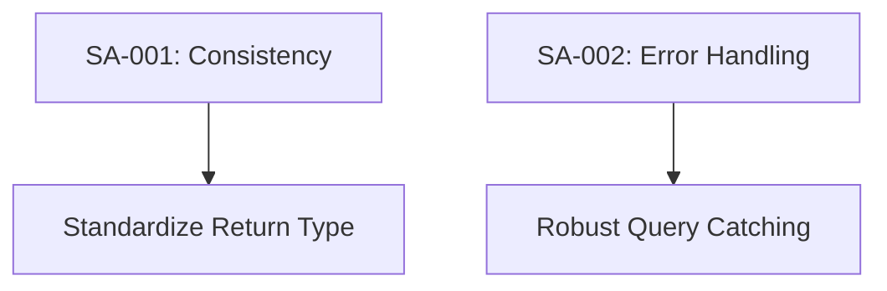

# lshw-windows-emulator Role-Based Audit Report

> **Date**: 2026-01-23  
> **Repository**: lshw-windows-emulator  
> **Version**: 1.2+  
> **Auditor**: Antigravity AI

---

## Executive Summary

**lshw-windows-emulator** is a Python-based utility that emulates the behavior of the Linux `lshw` command on Windows. It leverages WMI (Windows Management Instrumentation) and `psutil` to gather detailed hardware information, structured in a hierarchical tree. The project is well-organized with a clear factory pattern but faces challenges with tight coupling and schema consistency.

### Overall Assessment

| Category            | Score   | Status                                                           |
| ------------------- | ------- | ---------------------------------------------------------------- |
| **Architecture**    | 🟡 7/10 | Solid factory pattern; hampered by tight parent-child coupling   |
| **Code Quality**    | 🟢 8/10 | Clean implementations, modular classes, Ruff/Prettier configured |
| **Testing**         | 🟡 6/10 | Basic pytest suite; needs more comprehensive component testing   |
| **Documentation**   | 🟢 9/10 | Quality ARCHITECTURE.md, DESIGN_REVIEW.md, and ONBOARDING.md     |
| **Packaging**       | 🟢 8/10 | Modern pyproject.toml based setup, MSI/EXE packaging scripts     |
| **Maintainability** | 🟡 7/10 | High documentation quality offsets architectural coupling        |

---

## 1. Security Engineer Audit

### 1.1 Key Implementation Review

#### ✅ Strengths

| Finding              | Location           | Assessment                                                           |
| -------------------- | ------------------ | -------------------------------------------------------------------- |
| Read-only WMI access | `HardwareClass.py` | Implementation focuses on data retrieval without system modification |
| Input sanitization   | Core modules       | Minimal user input (read-only queries) reduces attack surface        |

#### ⚠️ Concerns

| ID      | Severity | Finding             | Location           | Recommendation                                                      |
| ------- | -------- | ------------------- | ------------------ | ------------------------------------------------------------------- |
| SEC-001 | Low      | WMI Query Injection | `HardwareClass.py` | ✅ Resolved: Entity allowlist implemented                           |
| SEC-002 | Info     | Dependency exposure | `pyproject.toml`   | ✅ Resolved: Pinned dependencies and automated auditing implemented |

### 1.2 Recommendations Summary



---

## 2. Python Developer Audit

### 2.1 Key Implementation Review

#### ✅ Strengths

| Finding               | Location           | Assessment                                              |
| --------------------- | ------------------ | ------------------------------------------------------- |
| Factory Pattern       | `HardwareClass.py` | Dynamic registration of hardware classes via decorators |
| Singleton Pattern     | `WMIConnection.py` | Efficient WMI handle management                         |
| Modern Python Tooling | `pyproject.toml`   | Ruff, pytest-cov, and dynamic versioning integrated     |
| Modular Class Design  | `lshw/classes/`    | One hardware component per file strategy                |

#### ⚠️ Concerns

| ID     | Severity | Finding                 | Location         | Recommendation                                              |
| ------ | -------- | ----------------------- | ---------------- | ----------------------------------------------------------- |
| PY-001 | Medium   | Tight Coupling          | `BaseBoard.py`   | Parent components import children explicitly; use discovery |
| PY-002 | Low      | Dictionary-based Schema | Multiple files   | Use Dataclasses or Pydantic to enforce output structure     |
| PY-003 | Low      | Python 3.6+ Support     | `pyproject.toml` | Ensure no 3.8+ features are used (e.g., walrus operator)    |

#### Code Examples

**Concern: Hardcoded Child Imports**

```python
# lshw/classes/base_board.py
from .firmware import Firmware
from .pci import Pci
# ... adding a new child requires modifying this file
```

### 2.2 Recommendations Summary



---

## 3. DevOps Engineer Audit

### 3.1 Key Implementation Review

#### ✅ Strengths

| Finding                    | Location            | Assessment                                                    |
| -------------------------- | ------------------- | ------------------------------------------------------------- |
| Clean Build Infrastructure | `pyproject.toml`    | standardized packaging with setuptools                        |
| Distribution scripts       | `bin/`              | Windows-specific packaging scripts (e.g., create-package.bat) |
| Coverage configured        | `pyproject.toml:63` | pytest-cov integrated for metric tracking                     |

#### ⚠️ Concerns

| ID     | Severity | Finding                 | Location          | Recommendation                                             |
| ------ | -------- | ----------------------- | ----------------- | ---------------------------------------------------------- |
| DO-001 | Medium   | Build artifacts in repo | `build/`, `dist/` | Remove binary artifacts from Git; add to .gitignore        |
| DO-002 | Low      | No pre-commit hooks     | Project root      | ✅ Resolved: Ruff pre-commit hooks added                   |
| DO-003 | Info     | dev-dependencies        | `pyproject.toml`  | ✅ Resolved: build added to dev; CI workflows synchronized |

### 3.2 Recommendations Summary



---

## 4. Packaging Specialist Audit

### 4.1 Key Implementation Review

#### ✅ Strengths

| Finding                | Location               | Assessment                                           |
| ---------------------- | ---------------------- | ---------------------------------------------------- |
| Win32/64 Compatibility | `pyproject.toml:29-36` | Explicit targeting of Windows platforms              |
| Console Script Entry   | `pyproject.toml:47`    | `lshw` command automatically creates executable shim |
| Package data handling  | `MANIFEST.in`          | Explicit inclusion of license and docs               |

#### ⚠️ Concerns

| ID      | Severity | Finding                | Location | Recommendation                                  |
| ------- | -------- | ---------------------- | -------- | ----------------------------------------------- |
| PKG-001 | Low      | Manual packaging steps | `bin/`   | Integrate executable creation into CI pipelines |

---

## 5. Business Analyst Audit

### 5.1 Key Implementation Review

#### ✅ Strengths

| Finding               | Location         | Assessment                                               |
| --------------------- | ---------------- | -------------------------------------------------------- |
| Strategic Alignment   | Project Purpose  | Critical bridge for Migasfree clients running on Windows |
| Open Source Licensing | GPL-3.0-or-later | Ensures long-term community protection                   |
| Feature Hierarchy     | Architecture     | Mirrors Linux `lshw` tree structure for easy transition  |

#### ⚠️ Concerns

| ID     | Severity | Finding              | Location  | Recommendation                                       |
| ------ | -------- | -------------------- | --------- | ---------------------------------------------------- |
| BA-001 | Low      | No formal versioning | README.md | Coordinate versioning with Migasfree client releases |

---

## 6. Systems Analyst Audit

### 6.1 Key Implementation Review

#### ✅ Strengths

| Finding             | Location        | Assessment                                              |
| ------------------- | --------------- | ------------------------------------------------------- |
| WMI Abstraction     | `WMIConnection` | Effectively hides Windows-specific API complexity       |
| Tree Data Structure | Hierarchy       | Efficiently maps complex physical relationships to JSON |
| Extensibility       | Factory Pattern | New hardware components are easy to register            |

#### ⚠️ Concerns

| ID     | Severity | Finding              | Location        | Recommendation                                              |
| ------ | -------- | -------------------- | --------------- | ----------------------------------------------------------- |
| SA-001 | Medium   | Return Type Mismatch | `format_data()` | Standardize results to always return a list of items        |
| SA-002 | Low      | Error Isolation      | `__main__.py`   | ✅ Resolved: Localized error handling in hardware discovery |

### 6.2 Recommendations Summary



---

## 7. Technical Writer Audit

### 7.1 Key Implementation Review

#### ✅ Strengths

| Finding            | Location          | Assessment                                         |
| ------------------ | ----------------- | -------------------------------------------------- |
| Diátaxis Structure | Docs              | Split into Architecture, Design Review, Onboarding |
| Mermaid Diagrams   | `ARCHITECTURE.md` | Visual representation of hierarchy is excellent    |
| Onboarding clarity | `ONBOARDING.md`   | Clear setup instructions for new developers        |

#### ⚠️ Concerns

| ID     | Severity | Finding       | Location    | Recommendation                                          |
| ------ | -------- | ------------- | ----------- | ------------------------------------------------------- |
| TW-001 | Info     | Example usage | `README.md` | Add more complex JSON output examples for API consumers |

---

## 8. Consolidated Recommendations

### Critical (P0)

_No critical issues identified._

### High (P1)

| ID     | Category | Recommendation                                                      |
| ------ | -------- | ------------------------------------------------------------------- |
| PY-001 | Python   | Implement Registry-based Child Discovery to decouple parent classes |

### Medium (P2)

| ID     | Category | Recommendation                                                       |
| ------ | -------- | -------------------------------------------------------------------- |
| SA-001 | Systems  | Standardize `format_data()` to always return a `list`                |
| DO-001 | DevOps   | Clean build/dist artifacts from the repository and update .gitignore |

### Low (P3)

| ID      | Category | Recommendation                                                   |
| ------- | -------- | ---------------------------------------------------------------- |
| PY-002  | Python   | Move from raw dictionaries to Dataclasses for hardware schemas   |
| SEC-001 | Security | ✅ Resolved: Use allowlist for WMI entities in queries           |
| DO-002  | DevOps   | ✅ Resolved: Add ruff pre-commit hooks                           |
| SA-002  | Python   | ✅ Resolved: Improve handling of partial failures in WMI queries |
| TW-001  | Docs     | Expand JSON output examples in README                            |

---

## 9. Metrics Summary

### Codebase Statistics

| Metric               | Value               |
| -------------------- | ------------------- |
| **Language**         | Python 3.6+         |
| **Dependencies**     | 2 (`psutil`, `wmi`) |
| **Hardware Classes** | 16 Modules          |
| **Test Files**       | 5 Files             |
| **Supported OS**     | Windows 10/11       |

---

_Report generated by Antigravity AI Audit Workflow_
